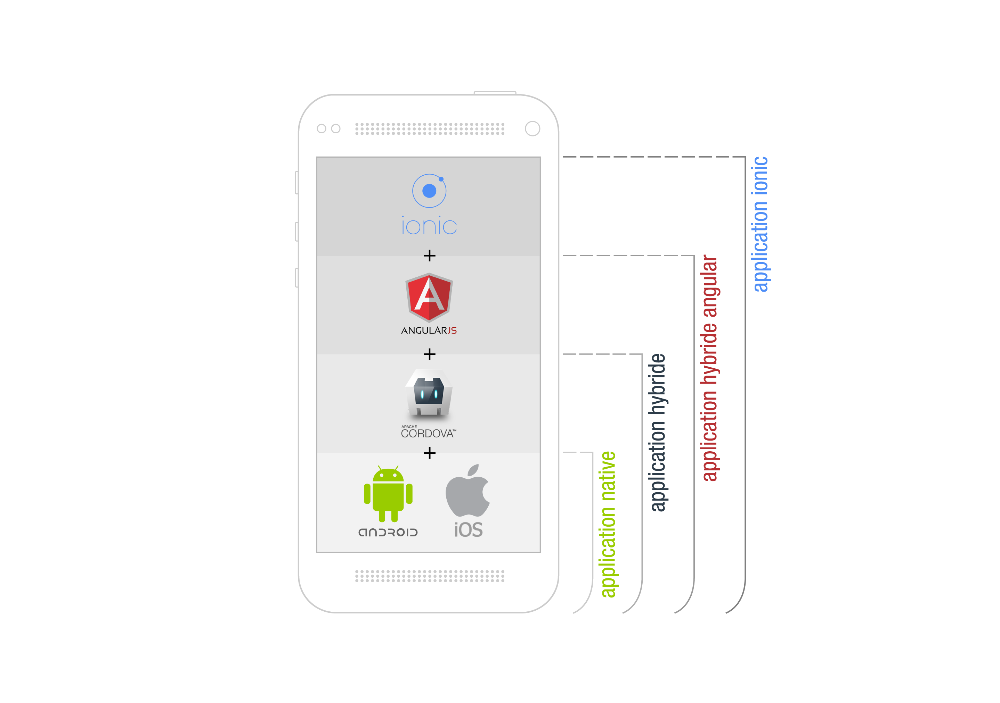

# Guide de développement d'applications mobiles hybrides accessibles avec Ionic et OnsenUI

Ce guide s'adresse aux développeurs d'applications mobiles qui souhaitent connaître les techniques à utiliser pour créer des applications accessibles avec les frameworks Ionic et OnsenUI.

## Avertissement

Les différents tests réalisés pour étudier l'accessibilité d'Ionic et d'OnsenUI conduisent à la conclusion que ces frameworks ne peuvent actuellement pas être utilisés pour développer rapidement et de manière sûre une application accessible. Il est préférable de développer des applications natives, en utilisant les API d'iOS et d'Android pour atteindre un bon niveau d'accessibilité. Les éléments fournis dans ces tutoriels visent à accompagner le développeur dans l'évaluation de l'accessibilité des composants et dans la mise en oeuvre de corrections qui peut toutefois s'avérer complexe. Par ailleurs, la pérennité de telles corrections n'est pour le moment pas garantie&nbsp;: pour qu'elle le soit, les corrections devront être intégrées dans les différents frameworks.

## Présentation et description d'Ionic et d'OnsenUI

[Ionic](http://ionicframework.com) et [OnsenUI](https://onsen.io) sont des boîtes à outils pour développer des applications hybrides. Une application hybride est écrite en <abbr title="Hypertext Markup Language" lang="en">HTML</abbr>, <abbr title="Cascading Style Sheets" lang="en">CSS</abbr> et JavaScript dans un conteneur WebView natif et peut être exécutée sur différentes plates-formes (iOS, Android, etc.) sans changement du code. Les technologies utilisées sont [Apache Cordova](https://cordova.apache.org), <abbr title="Syntactically Awesome Style Sheets" lang="en">SASS</abbr> et [AngularJs](https://angularjs.org/).
Ionic et OnsenUI proposent des composants réutilisables, en mettant l'accent sur les performances et la facilité d'implémentation. Par ailleurs, Ionic et OnsenUI mettent à disposition des outils pour développer, tester, déployer et analyser les applications.

L'architecture d'Ionic et d'OnsenUI peut être divisée en quatre couches (le schéma ci-dessus est valable à la fois pour Ionic et OnsenUI)&nbsp;:
* La couche native, qui varie suivant l'<abbr lang="en" title="Operating System">OS</abbr>. Si nous n'utilisions que cette couche, nous aurions créé une application native pure.
* La couche Apache Cordova. C'est ici que l'application hybride commence. Il est possible d'intégrer une application web sans couche supplémentaire, en ayant des interactions natives grâce aux plugins fournis par Cordova (Notifications, GPS, Contacts…).
* La couche AngularJs nous permet ici de créer une application hybride riche, avec un système de route, vue, contrôleur…
* La dernière couche, Ionic ou OnsenUI, apporte un ensemble de composants d'interface web reproduisant le design et les modes d'intraction natifs des composants d'iOS et d'Android (checkbox, toggle, radio, modal…).

Ce tutoriel traitera de l’accessibilité dans le contexte d'une application Ionic ou OnsenUI.

Pré-requis nécessaires&nbsp;:
* Les outils&nbsp;: npm, bower, cordova, Android Studio et/ou xcode
* Connaissance de l'environnement hybride Apache Cordova
* Connaissance de la création d'application riche sous AngularJS (modules, services, directives)
* Connaissance de Ionic et OnsenUI

Pour débuter, nous verrons comment initaliser un projet et mettre en place une structure pour créer un projet d'application accessible sous Ionic et OnsenUI.
Nous verrons ensuite les bonnes pratiques à utiliser dans l'environnement Apache Cordova et nous étudierons l'accessibilité des plugins Apache Cordova.
Pour finir nous ferons l'étude de l'accessibilité des composants d'interface d'Ionic et d'OnsenUI pour aider et accompagner un développeur qui souhaiterait utiliser ces frameworks pour développer une application mobile accessible.

* [Initialisation d'un projet Ionic et OnsenUI](./docs/initialisation.md)
* [Bonnes pratiques sous Cordova et étude d'accessibilité des plugins Cordova](./docs/cordova.md)
* [Tutoriel de mise en accessibilité d'une application Ionic](./docs/ionic.md)
* [Tutoriel de mise en accessibilité d'une application OnsenUI](./docs/onsenui.md)
* [Synthèse des tests et correctifs proposés](./docs/synthese_tests.md)

## Guides connexes

Les guides suivants peuvent être consultés en complément&nbsp;:

* [Guide d'audit d'applications mobiles](https://github.com/DISIC/guide-mobile_app_audit)
* [Guide de conception d'applications mobiles accessibles](https://github.com/DISIC/guide-mobile_app_conception)
* [Guide de développement d'applications mobiles accessibles avec les API Android et iOS](https://github.com/DISIC/guide-mobile_app_dev_natif)

## Licence
Ce document est la propriété du Secrétariat général à la modernisation de l'action publique français (SGMAP). Il est placé sous la [licence ouverte 1.0 ou ultérieure](http://wiki.data.gouv.fr/wiki/Licence_Ouverte_/_Open_Licence), équivalente à une licence <i lang="en">Creative Commons BY</i>. Pour indiquer la paternité, ajouter un lien vers la version originale du document disponible sur le [compte Github de la DInSIC](https://github.com/DISIC).
