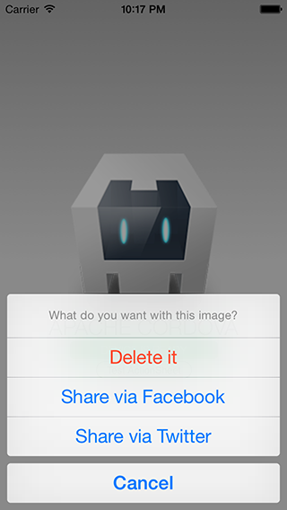
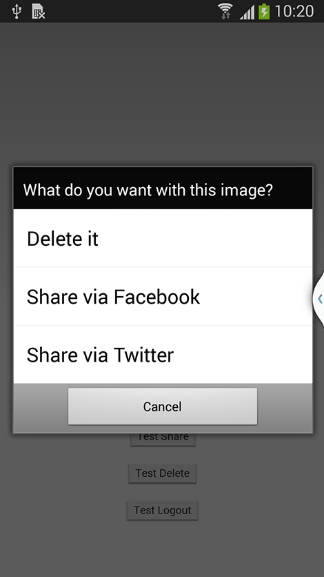
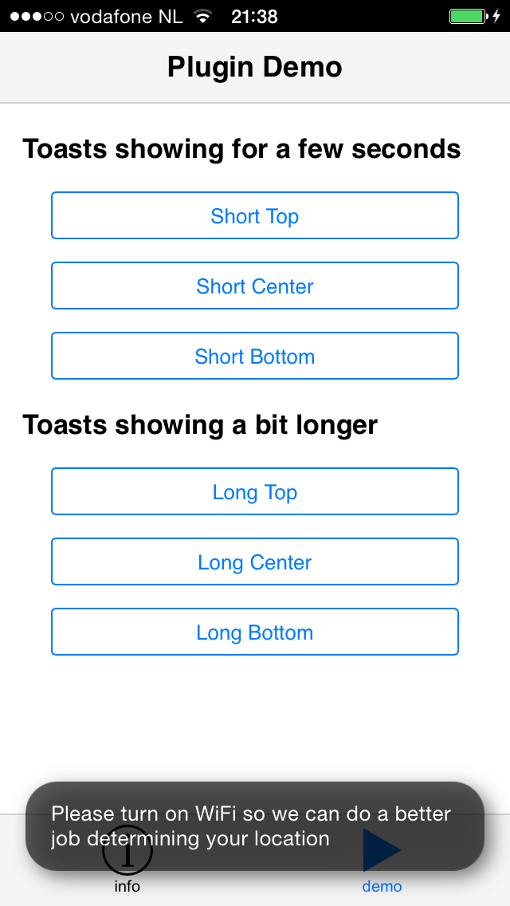
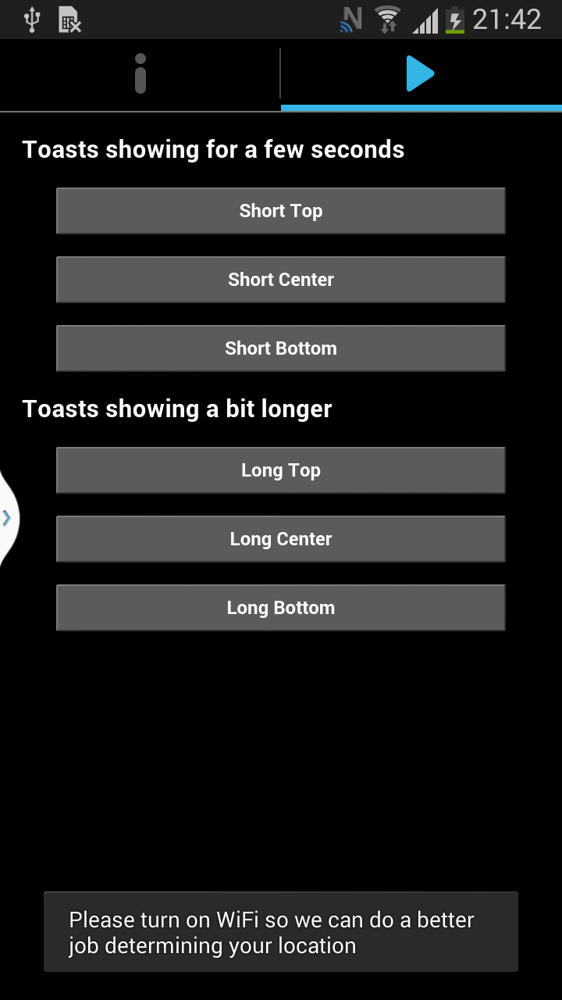

En premier lieu nous allons présenter Cordova et ngCordova pour bien les différencier. Nous verrons comment ajouter des plugins dans notre application et comment cela peut interférer avec l'accessibilité de l'application.


# Cordova v5.0.0


Cordova vous permet la création d'applications natives en utilisant <abbr title="Hypertext Markup Language" lang="en">HTML</abbr>, <abbr title="Cascading Style Sheets" lang="en">CSS</abbr> et <span lang="en">JavaScript</span>. Les applications peuvent être ainsi distribuées sur les <span lang="en">app stores</span> mobiles. Il est possible d'ajouter des <span lang="en">plugins</span> pour interagir nativement avec le mobile (Lecteur RFID, alarmes, notifications…), ces interactions sont pour la plupart impossibles depuis du mobile web.

Cordova encapsule l'application web dans un conteneur WebView natif. Un conteneur WebView natif peut être assimilé à un navigateur sans barre d'adresse, ce qui veut dire que Cordova supporte la plupart des fonctions des navigateurs mobiles. Une grande partie des règles d'accessibilité web mobile s'applique au développement sous Cordova.

Les règles communes avec l'accessiblité web sont&nbsp;:
* Utiliser un ordre logique de lecture&nbsp;;
* Ajouter des alternatives sur les images si nécessaire&nbsp;;
* Utiliser la bonne sémantique web&nbsp;;
* Gérer correctement le focus&nbsp;;
* Utiliser un contraste suffisant pour le texte&nbsp;.

D'une manière générale il faut suivre les [critères du <abbr title="Référentiel général d'accessibilité pour les administrations">RGAA</abbr> 3](http://references.modernisation.gouv.fr/rgaa/criteres.html) étendu par la [liste des critères spécifiques aux plateformes mobiles/tactiles](https://github.com/DISIC/referentiel-mobile-tactile/blob/master/refentiel-mobile-tactile-liste-criteres.md).

La difficulté de l'accessiblité mobile web est que l'ensemble des gestes sont interceptés par le lecteur d'écran. En effet le <span lang="en">swipe</span> vers la droite avec le lecteur d'écran permet de passer à l'élément suivant, et n'enverra aucun événement `touch`. Certains motifs de conception <abbr title="Accessible Rich Internet Applications" lang="en">WAI-ARIA</abbr> ne sont pas adaptés au mobile. En effet, il n'y a pas de clavier physique sur le mobile, seulement l'événement `click`. Par conséquent, il n'est pas possible d'augmenter la valeur d'un <span lang="en">slider</span> ou encore d'ouvrir un <span lang="en">treeview</span> sans flèche de droite.
Ce qui invalide certains motifs de conception <abbr title="Accessible Rich Internet Applications" lang="en">WAI-ARIA</abbr>, [voir la liste](https://github.com/w3c/aria/issues/60).

## ngCordova v0.1.17-alpha

ngCordova a été créé par l'équipe <span lang="en">Ionic</span> pour enrichir votre application <span lang="en">AngularJs</span> en appelant directement les <span lang="en">plugins</span> Cordova les plus répandus.
Un <span lang="en">plugin</span> Cordova vous permettra ainsi d'effectuer des interactions natives avec le mobile depuis le code Javascript.

## Création d'une application accessible avec ngCordova

### Installation de ngCordova
On peut facilement installer ngCordova via <span lang="en">bower</span>.

```shell
bower install ngCordova
```

Ensuite, il suffit d'ajouter le script dans le fichier index.html

```html
<!DOCTYPE html>
<html>
  <head>
    <script src="lib/ngCordova/dist/ng-cordova.js"></script>
    <script src="cordova.js"></script>
  </head>
  <body>
    …
  </body>
</html>
```

Et d'injecter le module <span lang="en">AngularJs</span> dans notre application.

```javascript
angular.module('myApp', ['ngCordova'])
```

Nous avons accès à une multitude de <span lang="en">wrappers</span> <span lang="en">AngularJs</span> pour nos <span lang="en">plugins</span> Cordova. Chaque <span lang="en">plugin</span> Cordova va maintenant être installé unitairement. De cette façon, nous démarrons avec une application assez légère qui va s'enrichir petit à petit de nouvelles fonctionnalités.
[Liste des plugins ngCordova](http://ngcordova.com/docs/plugins/)

### Les plugins ngCordova

Pour créer une application accessible avec ngCordova, nous avons le choix entre plusieurs <span lang="en">plugins</span>. Pour simplifier, les <span lang="en">plugins</span> peuvent être regroupés en 2 catégories&nbsp;:
* Les <span lang="en">plugins</span> offrant des services (Base de données locale, Géolocalisation, Google Analytics…) qui ne souffriront pas de problèmes d'accessibilité
* Les <span lang="en">plugins</span> d'interfaces utilisateurs (ActionSheet, Notification, Dialogs…) qui doivent être audités pour valider leurs accessibilité.

Malheureusement, il ne sera pas possible de corriger l'accessiblité du <span lang="en">plugin</span> d'interface utilisateur depuis l'application <span lang="en">JavaScript</span>, ce qui rendra souvent le <span lang="en">plugin</span> inutilisable tant que l'anomalie n'aura pas été corrigée dans le <span lang="en">plugin</span> d'origine.

#### $cordovaActionSheet v1.1.7

$cordovaActionSheet diffère complètement de $ionicActionSheet. $cordovaActionSheet est appelé en JavaScript et utilise soit `UIActionSheet` pour <span lang="en">iOS</span> soit `AlertDialog` pour Android. $ionicActionSheet est une implémentation entièrement faite en <abbr title="Hypertext Markup Language" lang="en">HTML</abbr>, <span lang="en">JavaScript</span> et <abbr title="Cascading Style Sheets" lang="en">CSS</abbr>. En utilisant $cordovaActionSheet, on garde un avantage en appellant des motifs de conception natifs dans chacun des OS.





On peut l'installer en utilisant les commandes&nbsp;:

```shell
cordova plugin add https://github.com/EddyVerbruggen/cordova-plugin-actionsheet.git --save
cordova prepare
```

Ensuite, la documentation nous présente un exemple d'utilisation.

```javascript
module.controller('ThisCtrl', function($cordovaActionSheet) {

  var options = {
    title: 'What do you want with this image?',
    buttonLabels: ['Share via Facebook', 'Share via Twitter'],
    addCancelButtonWithLabel: 'Cancel',
    androidEnableCancelButton : true,
    winphoneEnableCancelButton : true,
    addDestructiveButtonWithLabel : 'Delete it'
  };

  document.addEventListener("deviceready", function () {

    $cordovaActionSheet.show(options)
      .then(function(btnIndex) {
        var index = btnIndex;
      });
  }, false);

});
```

Lors des tests, l'action ouvre directement les composants natifs des OS. De ce fait, les potentiels problèmes seraient dûs à l'OS, mais il n'en est rien. L'ouverture de la fenêtre modale est correcte en termes d'implémentation aussi bien sur la sémantique, les interactions de l'utilisateur ou la gestion du focus.

Documentation&nbsp;: http://ngcordova.com/docs/plugins/actionSheet


#### $cordovaToast v2.1.1

$cordovaToast est une implémentation qui diffère de la précédente. En effet, c'est une interaction native créée à partir de plusieurs sous-éléments natifs.

Toast est une implémentation native dans l'OS <span lang="en">Android</span> qui permet l'envoi de notifications courtes à l'utilisateur. Néanmoins, il n'y a pas d'implémentation équivalente directe dans <span lang="en">iOS</span>, c'est donc le créateur du plugin qui va recréer l'aspect d'une notification Toast dans <span lang="en">iOS</span>.



On peut l'installer en utilisant les commandes&nbsp;:

```shell
cordova plugin add https://github.com/EddyVerbruggen/Toast-PhoneGap-Plugin.git
cordova prepare
```

Ci-dessous, la documentation nous présente un exemple d'utilisation.

```javascript
module.controller('MyCtrl', function($scope, $cordovaSpinnerDialog) {

  $cordovaSpinnerDialog.show("title","message", true);

  $cordovaSpinnerDialog.hide();
});
```
Lors des tests, le message est correctement énoncé dans <span lang="en">Android</span>. Un problème se pose avec la version iOS, en effet l'affichage de la notification ne déclenche aucun message dans <span lang="en">VoiceOver</span>. Ici, le problème vient de l'implémentation du plugin <span lang="en">"Toast-PhoneGap-Plugin"</span> donc il n'est pas possible de corriger via du code JavaScript, il faut réécrire une partie du code Objective-C pour envoyer une notification au lecteur d'écran <span lang="en">VoiceOver</span>.

Ouvrir une anomalie ou soumettre un correctif est la meilleure alternative pour garder la maintanabilité du projet.

Documentation : http://ngcordova.com/docs/plugins/toast

## Conclusion

Cordova est utilisable pour créer une application accessible simple si le développeur respecte les règles d'accessiblité mobile. Il est important de souligner que certains motifs de conception <abbr title="Accessible Rich Internet Applications" lang="en">WAI-ARIA</abbr> ne seront pas adaptés au mobile. De manière générale, Cordova est adapté aux projets mobiles ayant un niveau technique simple, il en est de même pour l'accessiblité. En ce qui concerne les <span lang="en">plugins</span>, l'accessiblité est laissée à la liberté du créateur. Il est donc important de tester le <span lang="en">plugin</span> pour valider son implémentation.

## Licence
Ce document est la propriété du Secrétariat général à la modernisation de l'action publique français (SGMAP). Il est placé sous la [licence ouverte 1.0 ou ultérieure](https://www.etalab.gouv.fr/licence-ouverte-open-licence), équivalente à une licence <i lang="en">Creative Commons BY</i>. Pour indiquer la paternité, ajouter un lien vers la version originale du document disponible sur le [compte <span lang="en">Github</span> de la DInSIC](https://github.com/DISIC).
