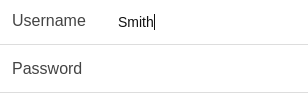
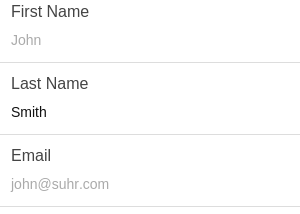
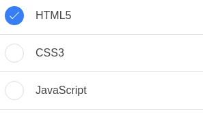
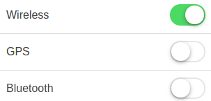
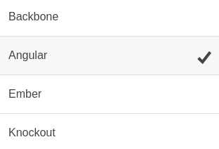

# <span lang="en">Ionic</span>

Nous allons étudier les composants d'interface d'<span lang="en">Ionic</span> en version 1.0.1 "vanadium-vaquita" (2015-06-30).

Il n’y a pas de documentation ou de composants dédiés à l’accessibilité dans <span lang="en">Ionic</span>, et l’une des seules références est une [anomalie](https://github.com/driftyco/ionic/issues/307) pour rendre <span lang="en">Ionic</span> accessible mais annulée car trop vague. On remarque que l'accessibilité n'est pas une priorité de l'équipe d'<span lang="en">Ionic</span> pour la version 1.0.1.

## Corrections spécifiques à <span lang="en">Ionic</span>

### Module <span lang="en">JavaScript</span>

Les directives d'<span lang="en">Ionic</span> ne sont pas très flexibles car les <span lang="en">templates</span> ne sont pas customisables. Ce qui veut dire que toute correction devra se faire dans une nouvelle directive en recopiant la fautive.
Dans le module et les directives, <span lang="en">Ionic</span> a renommé les fonctions angular pour simplifier l'écriture. En recopiant une directive il faudra donc migrer certaines fonctions. Voici la [liste](https://github.com/driftyco/ionic/blob/1.0.1/js/angular/main.js)&nbsp;:
* extend = angular.extend
* forEach = angular.forEach
* isDefined = angular.isDefined
* isNumber = angular.isNumber
* isString = angular.isString
* jqLite = angular.element
* noop = angular.noop

Si nous copions une directive contenant `forEach`, il faudra rennommer la fonction en `angular.forEach` ([Exemple avec ion-toggle](#ion-toggle)).

En recopiant une directive, il faudra la renommer pour ne pas interférer avec l'ancienne. 
Dans notre exemple, toutes les directives recopiées ont été renommées en ajoutant `-ally` (exemple: `ion-toggle` devient `ion-toggle-ally`).

### Module <abbr title="Cascading Style Sheets" lang="en">CSS</abbr>

Le module <abbr title="Cascading Style Sheets" lang="en">CSS</abbr> corrigera les règles erronées dans <span lang="en">Ionic</span>. Elles peuvent être de plusieurs natures&nbsp;:
* Les évémements sont bloqués par la propriété `pointer-events:none` et les clics ne sont plus transmis à l'application <span lang="en">JavaScript</span>&nbsp;;
* Un élément <abbr title="Hypertext Markup Language" lang="en">HTML</abbr> n'est pas focusable et il n'est donc pas utilisable par le lecteur d'écran&nbsp;;
* Les contrastes ne sont pas suffisants et il est nécessaire de les corriger.


## Corrections d'ordre générale

Lors de l'utilisation du framework, les erreurs relevées sont&nbsp;:
* Les événements du lecteur d'écran sont interceptés par <span lang="en">Ionic</span> sous Android 4.3 et 4.4 empêchant toute intéraction par utilisateur.
* Il est impossible d'utiliser le scroll avec le lecteur d'écran iOS.

## Correctifs appliqués pour interpréter les événements du lecteur d'écran Android

Lors des tests sous <span lang="en">Android</span> 4.3 et <span lang="en">Android</span> 4.4, il est impossible de cliquer ou de changer l’état d'une case à cocher avec <span lang="en">talkback</span>. Les événements sont interceptés par <span lang="en">Ionic</span> pour réduire le délai de latence des 300ms. http://blog.ionic.io/hybrid-apps-and-the-curse-of-the-300ms-delay/
Il faut donc désactiver cette interception en rajoutant l’attribut `data-tap-disabled="true"` sur la balise `body`.

```html
<body ng-app="starter" data-tap-disabled="true">
…
</body>
```

La désactivation du délai de <span lang="en">tap</span> rend l'application beaucoup plus lente lorsque le lecteur d'écran est inactif. Il faut donc corriger cette impression de latence.


### Correction de l'impression de latence sous <span lang="en">Ionic</span>

L'une des forces de l'implémentation hybride est de pouvoir accéder à une partie de l'API native depuis notre application écrite en <span lang="en">JavaScript</span>. On peut par exemple connaître l'état du lecteur d'écran pour corriger une erreur inhérente au framework <span lang="en">Ionic</span>.
Le but est de modifier l'attribut <span lang="en">`data-tap-disabled`</span> en fonction du lecteur d'écran.

```javascript
angular.module('a11y-ionic', ['$mobileAccessibility'])
.run(function($rootScope, $mobileA11yScreenReaderStatus) {
  function isScreenReaderRunningCallback(event, boolean) {
    var element = document.body;
    if (boolean) {
      console.log("Screen reader: ON");
      element.setAttribute("data-tap-disabled", "true");
    } else {
      console.log("Screen reader: OFF");
      element.setAttribute("data-tap-disabled", "false");
    }
  }

  $rootScope.$on('$mobileAccessibilityScreenReaderStatus:status', isScreenReaderRunningCallback);
})
```

De cette façon, si le lecteur d'écran est allumé, les événements `click` ne seront pas bloqués par <span lang="en">Ionic</span> et on pourra changer l'état des <span lang="en">checkbox</span>. Et lorsque le lecteur d'écran sera éteint, le délai de 300 ms sera supprimé pour donner une impression d'application native.

## Correction du <span lang="en">scrolling</span> sous iOS

<span lang="en">Ionic</span> fut créé lorsque les événements `scroll` natifs web n'étaient pas implémentés. Ils ont dû pour cela réimplémenter les événements `scroll` en <span lang="en">JavaScript</span>. Depuis, Android 4.1 a implémenté les événements `scroll` natifs, mais les WebViews iOS ne supportent pas cette implémentation. Donc les scrolls VoiceOver dans iOS sont interceptés par <span lang="en">Ionic</span>. Cela empêche de défiler correctement vers le bas avec un lecteur d'écran.

Lorsque l'on désactive le <abbr title="Cascading Style Sheets" lang="en">CSS</abbr>, le défilement fonctionne correctement. Il faut donc trouver la classe puis la propriété en erreur pour corriger cette anomalie.

Cette recherche peut se révéler très fastidieuse voire impossible sans l'aide du déboguage distant. Avec des essais successifs, on peut se rendre compte que les classes `.scroll-content` et `.pane` sont en cause, il faut revenir en position statique. De plus en ajoutant les classes `.platform-ios` et `.sr-on`, nous pouvons faire cette correction uniquement pour la plateforme iOS ayant un lecteur d'écran actif.

```css
.platform-ios.sr-on .pane,
.platform-ios.sr-on .scroll-content{
  position: static;
}
```

En ajoutant cette correction, il est nécessaire de faire un ajustement de style pour le <span lang="en">header</span>.

```css
.platform-ios.sr-on .scroll-content{
  overflow-y: auto;
}

.scroll-content.has-header > .scroll {
  margin-top: 44px;
}
```

De cette façon, le défilement dans <span lang="en">iOS</span> fonctionne correctement. Néanmoins il est possible que d'autres régressions de style soient présentes dans des cas particuliers d'utilisation de <span lang="en">Ionic</span>. Le mieux serait une correction faite par l'équipe d'<span lang="en">Ionic</span> qui a une meilleure vue d'ensemble du projet.


## ion Forms

Documentation des champs de formulaire Ionic&nbsp;: http://ionicframework.com/docs/components/#forms

<span lang="en">Ionic</span> fournit plusieurs styles d'<span lang="en">input</span>&nbsp;:
* <span lang="en">Placeholder Labels</span>
* <span lang="en">Inline Labels</span>
* <span lang="en">Stacked Labels</span>
* <span lang="en">Floating Labels</span>
* <span lang="en">Inset Forms</span>
* <span lang="en">Inset Inputs</span>
* <span lang="en">Input Icons</span>
* <span lang="en">Header Inputs</span>

Pour les composants <span lang="en">`Placeholder Labels, Inset Forms, Inset Inputs, Input Icons, Header Inputs`</span>, les erreurs relevées sont&nbsp;:
* L'utlisation de <span lang="en">placeholder</span> n'est pas une alternative au label, en effet le <span lang="en">placeholder</span> n'est plus visible dès que l'on commence à remplir le champ&nbsp;;
* Le label est vide.

Pour le composant <span lang="en">`Floating Labels`</span>, l'erreur relevée est&nbsp;:
* L'étiquette de champ et son champ associé ne sont pas accolés. L'étiquette n'est pas visible.

Pour les composants <span lang="en">`Inline Labels`</span> et <span lang="en">`Stacked Labels`</span>, l'erreur relevée est&nbsp;:
* Absence de l'attribut `for` sur le <span lang="en">label</span> et l'`id` correspondant sur l'<span lang="en">input</span>.

### Composant non accessible

Les composants <span lang="en">`Placeholder Labels, Inset Forms, Inset Inputs, Input Icons, Header Inputs, Floating Labels`</span> ne peuvent pas être corrigés sans changer complètement l'aspect voulu par <span lang="en">Ionic</span>.

### Correctifs appliqués

Pour corriger les problèmes d'accessibilité sur les composants <span lang="en">`Inline Labels`</span> et <span lang="en">`Stacked Labels`</span>, nous avons ajouté l'attribut `for` sur le <span lang="en">label</span> et l'<span lang="en">id</span>.

#### Correction de l'<span lang="en">input Inline Labels</span>



```html
<div class="list">
  <label for="username" class="item item-input">
    <span class="input-label">Username</span>
    <input id="username" type="text">
  </label>
</div>
```


#### Correction de l'<span lang="en">input Stacked Labels</span>



```html
<div class="list">
  <label for="first-name" class="item item-input item-stacked-label">
    <span class="input-label">First Name</span>
    <input id="first-name" type="text" placeholder="John">
  </label>
</div>
```

## ion-checkbox

Documentation de <span lang="en">ion-checkbox</span> dans <span lang="en">Ionic</span>: http://ionicframework.com/docs/1.0.1/api/directive/ionCheckbox/



Pour le composant ion-checkbox l'erreur relevée est&nbsp;:
* La <span lang="en">checkbox</span> n’est pas <span lang="en">focusable</span> avec le lecteur d’écran.

### Correctifs appliqués

On va forcer la <span lang="en">checkbox</span> en `display:block` puis la rendre visible uniquement au lecteur d’écran.

```css
body .checkbox.checkbox-input-hidden input {
  display: block !important;
}

.checkbox.checkbox-input-hidden input {
  position: absolute;
  width: 1px;
  height: 1px;
  padding: 0;
  margin: -1px;
  overflow: hidden;
  clip: rect(0,0,0,0);
  border: 0;
}
```

On peut effectuer les tests de restitution sous <span lang="en">iOS</span> et <span lang="en">Android</span>. La prise de focus fonctionne bien, le <span lang="en">label</span> est énoncé par le lecteur d’écran, son type (“case à cocher”) et son état (“non coché”).

## ion-toggle

Documentation de <span lang="en">ion-toggle</span> dans <span lang="en">Ionic</span>: http://ionicframework.com/docs/1.0.1/api/directive/ionToggle/



Pour le composant ion-toggle les erreurs relevées sont&nbsp;:
* L'<span lang="en">input checkbox</span> n’est pas <span lang="en">focusable</span> avec le lecteur d’écran.
* Le label est vide.
* Les événements <span lang="en">`click`</span> ne sont pas envoyé sous <span lang="en">Android 5.0</span>.

### Correctifs appliqués

On va forcer la <span lang="en">checkbox</span> en `display:block` puis la rendre visible uniquement au lecteur d’écran.

```css
body .toggle input{
  display: block !important;
}

.toggle input{
  position: absolute;
  width: 1px;
  height: 1px;
  padding: 0;
  margin: -1px;
  overflow: hidden;
  clip: rect(0,0,0,0);
  border: 0;
}
```

Nous voyons aussi que la structure <abbr title="Hypertext Markup Language" lang="en">HTML</abbr> n’est pas correcte&nbsp;: le <span lang="en">`label`</span> est vide. Malheureusement le <span lang="en">template</span> de la directive n’est pas modifiable, nous devons recopier la directive sous un autre nom pour la modifier&nbsp;:

```javascript
.directive('ionToggleAlly', [
  '$timeout',
  '$ionicConfig',
function($timeout, $ionicConfig) {

  return {
    restrict: 'E',
    replace: true,
    require: '?ngModel',
    transclude: true,
    template:
      '<label class="item item-toggle">' +
        '<div ng-transclude></div>' +
        '<div class="toggle">' +
          '<input type="checkbox">' +
          '<div class="track">' +
            '<div class="handle"></div>' +
          '</div>' +
        '</div>' +
      '</label>',

    compile: function(element, attr) {
      var input = element.find('input');
      angular.forEach({
        'name': attr.name,
        'ng-value': attr.ngValue,
        'ng-model': attr.ngModel,
        'ng-checked': attr.ngChecked,
        'ng-disabled': attr.ngDisabled,
        'ng-true-value': attr.ngTrueValue,
        'ng-false-value': attr.ngFalseValue,
        'ng-change': attr.ngChange,
        'ng-required': attr.ngRequired,
        'required': attr.required
      }, function(value, name) {
        if (angular.isDefined(value)) {
          input.attr(name, value);
        }
      });

      if (attr.toggleClass) {
        element[0].getElementsByTagName('div')[1].classList.add(attr.toggleClass);
      }

      element.addClass('toggle-' + $ionicConfig.form.toggle());

      return function($scope, $element) {
        var el = $element[0].getElementsByTagName('div')[1];
        var checkbox = el.children[0];
        var track = el.children[1];
        var handle = track.children[0];

        var ngModelController = angular.element(checkbox).controller('ngModel');

        $scope.toggle = new ionic.views.Toggle({
          el: el,
          track: track,
          checkbox: checkbox,
          handle: handle,
          onChange: function() {
            if (ngModelController) {
              ngModelController.$setViewValue(checkbox.checked);
              $scope.$apply();
            }
          }
        });

        $scope.$on('$destroy', function() {
          $scope.toggle.destroy();
        });
      };
    }

  };
}])
```

Avec ce nouveau <span lang="en">template</span>, le label n'est plus vide. Mais en effectuant les tests sous Android 5.0 la `checkbox` ne change pas d'état.
En effet les événements sont bloqués par la propriété <abbr title="Cascading Style Sheets" lang="en">CSS</abbr> `pointer-events:none;` sur l'item <span lang="en">toggle</span>. Il faut donc remettre à la valeur par défaut.

```css
.item-toggle{
  pointer-events: auto;
}
```

De cette manière les événements `click` sont correctement interceptés.

## ion-radio

Documentation de <span lang="en">ion-radio</span> dans <span lang="en">Ionic</span>: http://ionicframework.com/docs/1.0.1/api/directive/ionRadio/



Pour le composant ion-toggle les erreurs relevées sont&nbsp;:
* L'<span lang="en">input radio</span> n'est pas focusable sous <span lang="en">Android 5.0</span>.
* L'icône est focusable sous <span lang="en">Android</span> 5.0

### Correctifs appliqués

Cette fois-ci, une erreur apparaît lors de l'activation de l'<span lang="en">`input radio`</span> sous <span lang="en">Android 5.0</span>, on ne peut pas changer l'état. Pour diagnostiquer l'erreur, il faut partir d'une version sans modification de style, et retirer l'intégralité des classes <abbr title="Cascading Style Sheets" lang="en">CSS</abbr>. En ajoutant une à une les classes, nous pouvons ainsi trouver celle qui comporte la propriété <abbr title="Cascading Style Sheets" lang="en">CSS</abbr> qui pose problème.

L'erreur vient de la propriété `left: -9999px;` sur l'<span lang="en">`input`</span> qui est mal interprétée par <span lang="en">Talkback</span> dans <span lang="en">Android</span> 5.0. On va donc changer la propriété à 0 et cacher l'input aux lecteurs d'écran par précaution.

```css
.item-radio input {
  left: 0;
}
.item-radio input {
  position: absolute;
  width: 1px;
  height: 1px;
  padding: 0;
  margin: -1px;
  overflow: hidden;
  clip: rect(0,0,0,0);
  border: 0;
}
```

L'icône présente pour marquer l'état reste focusable mais n'est pas vocalisée sous <span lang="en">Android</span> 5.0. L'état étant déjà vocalisé par l'<span lang="en">`input`</span>, il est préférable de la cacher complètement avec la propriété `aria-hidden="true"` dans la directive.


```javascript
.directive('ionRadioAlly', function() {
  return {
    restrict: 'E',
    replace: true,
    require: '?ngModel',
    transclude: true,
    template:
      '<label class="item item-radio">' +
        '<input type="radio" name="radio-group">' +
        '<div class="item-content disable-pointer-events" ng-transclude></div>' +
        '<i aria-hidden="true" class="radio-icon disable-pointer-events icon ion-checkmark"></i>' +
      '</label>',

    compile: function(element, attr) {
      if (attr.icon) {
        element.children().eq(2).removeClass('ion-checkmark').addClass(attr.icon);
      }

      var input = element.find('input');
      angular.forEach({
          'name': attr.name,
          'value': attr.value,
          'disabled': attr.disabled,
          'ng-value': attr.ngValue,
          'ng-model': attr.ngModel,
          'ng-disabled': attr.ngDisabled,
          'ng-change': attr.ngChange,
          'ng-required': attr.ngRequired,
          'required': attr.required
      }, function(value, name) {
        if (angular.isDefined(value)) {
            input.attr(name, value);
          }
      });

      return function(scope, element, attr) {
        scope.getValue = function() {
          return scope.ngValue || attr.value;
        };
      };
    }
  };
})
```

## $ionicGesture

Nous nous basons ici sur les critères présents dans la proposition d'extension du RGAA pour les mobiles/tactiles (voir https://github.com/DISIC/referentiel-mobile-tactile/blob/master/refentiel-mobile-tactile-liste-criteres.md ).


Le critère 14.3 comporte le test suivant&nbsp;:

> Test 14.3.1&nbsp;: Chaque interaction  gestuelle déclenchant une action respecte-t-elle ces conditions&nbsp;?
>   * l'action est déclenchée uniquement à la fin de l'interaction gestuelle&nbsp;;
>   * l'action n'est pas déclenchée si l'élément déclencheur perd le focus.


Le premier test invalide plusieurs gestes&nbsp;:
 * Le geste <span lang="en">on-hold</span> va déclencher l'action pendant l'appui et non à la fin de l'interaction&nbsp;;
 * Le geste <span lang="en">on-touch</span> va déclencher l'action avant la fin de touchend ou mouseup&nbsp;;
 * Les actions <span lang="en">on-drag, on-drag-*</span> vont déclencher l'action avant la fin de touchend ou mouseup.

De la même manière le deuxième test invalide plusieurs gestes&nbsp;:
 * Les gestes <span lang="en">on-swipe, on-swipe-*</span> peuvent être déclenchés même si le focus est perdu&nbsp;;
 * Le geste <span lang="en">on-release</span> est déclenché peu importe où le focus se trouve.

Il reste 2 gestes valides&nbsp;:
 * <span lang="en">on-tap</span> pour les appuis courts&nbsp;;
 * <span lang="en">on-double-tap</span> pour les doubles appuis.


## $ionicModal

Documentation de <span lang="en">$ionicModal</span> dans <span lang="en">Ionic</span>: http://ionicframework.com/docs/1.0.1/api/service/$ionicModal/

La fenêtre modale <span lang="en">Ionic</span> affiche du contenu temporaire à l'utilisateur. On peut aussi bien afficher des actions, du contenu ou un formulaire à l'intérieur.

Pour le composant $ionicModal les erreurs relevées sont&nbsp;:
* L'utilisateur utilisant un lecteur d'écran ne peut pas interagir avec les éléments à l'intérieur de la modale.
* Le focus n'est pas renvoyé sur le premier élément à l'ouverture.
* Le focus peut sortir de la fenêtre modale en cours d'ouverture.
* À la fermeture le focus ne revient pas sur l'élément ayant permis d'ouvrir la fenêtre.
* La touche Echap ne ferme pas la fenêtre.
* Absence de l'attribut role="dialog".
* Absence de label pour la modale.


L'attribut <span lang="en">`data-tap-disabled="true"`</span> ne permet pas de désactiver la réduction du délai de 300 ms. La désactivation du <abbr title="Cascading Style Sheets" lang="en">CSS</abbr> et des propriétés <span lang="en">pointer-event</span> sont sans effet. Il est donc impossible pour un utilisateur avec un lecteur d'écran actif d'utiliser les fenêtres modales <span lang="en">Ionic</span> et aucune correction simple n'a été mise en évidence.

Il est préférable d'utiliser une fenêtre modale déjà accessible. <span lang="en">AngularJs</span> étant un <span lang="en">framework</span> assez flexible, on peut ajouter aussi bien une fenêtre modale <span lang="en">jQuery</span>, <span lang="en">React</span> ou <span lang="en">AngularJS</span>.

Le même problème se posera pour $ionicPopover et $ionicActionSheet.


## Conclusion

Lors de ce tutoriel, nous remarquons bien que <span lang="en">Ionic</span> n'a pas été conçu pour être accessible. La première raison est sûrement l'interception des événements </span>click</span> pour réduire le délai de 300ms, qui empêche toutes les actions avec un lecteur d'écran. Ensuite, nous nous rendons compte qu'aucun test n'a été fait avec un lecteur d'écran VoiceOver, car il est impossible de défiler dans l'application avec un lecteur d'écran. Sur l'ensemble des composants, seulement une petit partie sera effectivement corrigeable (ion Forms: Inline Labels et Stacked Labels, ion-checkbox, ion-toggle, ion-radio) ce qui limite l'intérêt de l'utilisation d'<span lang="en">Ionic</span> pour créer une application accessible.

Si vous souhaitez faire une application <span lang="en">iOS</span>, il est préférable d'attendre que [l'anomalie sur le défilement](https://github.com/driftyco/ionic/issues/4100) soit corrigée, il est possible d'utiliser <span lang="en">Ionic</span> mais cela risque d'être très chronophage en l'état et de provoquer des régressions ou des comportements inattendus.

Si vous souhaitez faire une application <span lang="en">Android</span>, il est très important de tester l'application sur <span lang="en">Android</span> > 5 et <span lang="en">Android</span> 4.4. Il peut y avoir beaucoup de comportements différents entre les deux versions OS, en effet la <span lang="en">WebView</span> n'est pas la même et l'accessibilité peut comporter des anomalies sur une seule des versions.

De manière générale, <span lang="en">Ionic 1.0.1</span> n'est pas recommandable pour créer une application accessible. Il est préférable d'utiliser Cordova et de créer sa propre application. Nous pourrions éventuellement travailler sans le module <span lang="en">JavaScript Ionic</span> et charger seulement la feuille <abbr title="Cascading Style Sheets" lang="en">CSS</abbr>, mais il faudrait prendre garde à la structure <abbr title="Hypertext Markup Language" lang="en">HTML</abbr>, aux propriétés <span lang="en">`pointer-events:none`</span> et aux problèmes éventuels de contrastes.

## Licence
Ce document est la propriété du Secrétariat général à la modernisation de l'action publique français (SGMAP). Il est placé sous la [licence ouverte 1.0 ou ultérieure](http://wiki.data.gouv.fr/wiki/Licence_Ouverte_/_Open_Licence), équivalente à une licence <i lang="en">Creative Commons BY</i>. Pour indiquer la paternité, ajouter un lien vers la version originale du document disponible sur le [compte <span lang="en">Github</span> de la DInSIC](https://github.com/DISIC).
